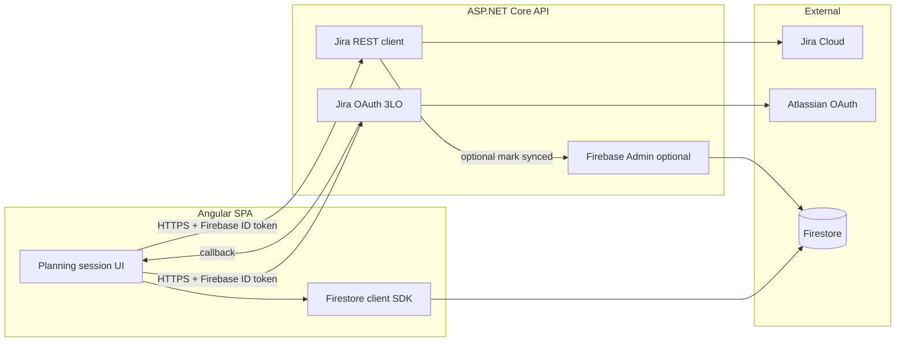

# Jira Cloud integration — architecture

This document describes how the Angular planning poker app, the **ASP.NET Core** Jira API (`server-dotnet/PokerPlanning.Api`), Jira Cloud (OAuth 2.0 3LO), and Firestore fit together.

## High-level diagram



## Frontend responsibilities

- **Session & story state**: Create/read planning sessions, stories, votes, and moderator actions via Firestore (existing app behavior).
- **Jira linking (session)**: Collect `jiraSiteUrl`, `jiraConnected`, optional `jiraBoardId` (Scrum estimation) on the session document.
- **Linked issue (story)**: Store `jiraIssueKey` on the active story; validate key format client-side.
- **OAuth UX**: Call `POST /api/jira/oauth/start` with `Authorization: Bearer <Firebase ID token>` and `{ returnUrl }`, then navigate to returned `redirectUrl` (Atlassian authorize page). After redirect back from the API callback, read `jira_connected` / `jira_site` query params and persist to Firestore.
- **Issue preview**: Call `GET /api/jira/issues/:issueKey?siteUrl=...` with a Firebase ID token; render summary, status, assignee, etc.
- **Final estimate sync**: After moderator selects final estimate and votes are revealed, call `POST /api/jira/sync-estimate` with estimate, votes, participants, flags; on success update Firestore `jiraSyncedAt` (client-side and/or server-side via Admin).

## Backend responsibilities

- **Verify caller identity**: All Jira endpoints require `Authorization: Bearer <Firebase ID token>` (verified with Firebase Admin).
- **OAuth 2.0 (3LO)**: Start URL generation, callback handling, authorization code exchange, secure token storage, refresh before Jira calls.
- **Token storage**: Encrypt Atlassian access/refresh tokens at rest (AES-256-GCM); persist in SQLite (or PostgreSQL when configured) via Entity Framework.
- **Jira API**: Resolve `cloudId` from `siteUrl` using `GET /oauth/token/accessible-resources`, then call `ex/jira/{cloudId}/rest/api/3/...`.
- **Estimation**: Prefer board-based estimation when `jiraBoardId` or `JIRA_DEFAULT_BOARD_ID` is set; otherwise update the configured Story Points custom field (`JIRA_STORY_POINTS_FIELD_ID`).
- **Audit**: Append structured audit entries to an issue property (`planningPokerAudit`) and optionally add a human-readable Jira comment with session id, participants, votes, final estimate, timestamp.
- **Optional Firestore write**: If Firebase Admin is configured, set `jiraSyncedAt` on the story document after a successful Jira update (idempotent with client).

## OAuth 2.0 (3LO) flow

1. User signs in with Firebase (including anonymous).
2. User clicks **Connect Jira**. SPA obtains a Firebase **ID token** and calls `POST /api/jira/oauth/start` with `{ returnUrl }`.
3. API verifies the ID token, creates a short-lived **state** record (in-memory; use Redis in multi-instance production), and returns `{ redirectUrl }` pointing to `https://auth.atlassian.com/authorize` with `audience=api.atlassian.com`, `client_id`, `redirect_uri`, `response_type=code`, `prompt=consent`, `scope` (from `Atlassian:Scopes` / `Atlassian__Scopes`; **must match** the OAuth app’s enabled permission codes — verified reference string in `server-dotnet/README.md` § *Referans — doğrulanmış `Atlassian__Scopes`*), and `state`.
4. Browser navigates to `redirectUrl`. User approves at Atlassian.
5. Atlassian redirects to `GET /api/jira/oauth/callback?code=...&state=...`.
6. API validates `state`, exchanges `code` for access/refresh tokens, stores encrypted tokens keyed by **Firebase UID**, resolves a default `jira_site` from accessible resources, redirects to `returnUrl?jira_connected=1&jira_site=<encoded site URL>`.
7. SPA strips query params and saves Jira settings to Firestore.

**Refresh**: Before Jira calls, if access token expires within a sliding window (e.g. 5 minutes), call `POST https://auth.atlassian.com/oauth/token` with `grant_type=refresh_token`.

## Firestore data model (Jira-related)

Stored in existing collections (no separate “Jira collection” required):

**`planning_poker_sessions/{sessionId}` — `settings` map**

| Field | Type | Purpose |
|--------|------|--------|
| `jiraSiteUrl` | string | Normalized origin, e.g. `https://team.atlassian.net` |
| `jiraConnected` | boolean | User completed OAuth or confirmed site |
| `jiraIntegrationEnabled` | boolean | Per-session kill switch for Jira UI |
| `jiraBoardId` | string (optional) | Scrum board id for Agile estimation API |

**`planning_poker_sessions/{sessionId}/stories/{storyId}`**

| Field | Type | Purpose |
|--------|------|--------|
| `jiraIssueKey` | string | e.g. `EVRST-1386` |
| `jiraSyncedAt` | timestamp | Set when estimate successfully pushed to Jira |

Issue metadata (summary, status, …) is **not** duplicated in Firestore by default; it is loaded on demand from the backend.

### Security rules

An example rules file ships at the repo root: `firestore.rules`, referenced from `firebase.json`. Deploy with:

`firebase deploy --only firestore:rules`

Review and tighten `create`/`update` conditions for your deployment (field lists, session status). Moderators need write access to `settings.*` (including `jiraBoardId`) and stories; members need `votes` writes only for `memberId == request.auth.uid` after they have joined.

## API contract (Angular ↔ backend)

Base URL: `environment.jiraBackendApiUrl` (e.g. `http://localhost:4000/api` when running `dotnet run` for `PokerPlanning.Api`).

All authenticated routes:

```http
Authorization: Bearer <Firebase ID token>
```

### `POST /jira/oauth/start`

**Body**

```json
{ "returnUrl": "https://app.example.com/session/create" }
```

**Response `200`**

```json
{ "redirectUrl": "https://auth.atlassian.com/authorize?..." }
```

### `GET /jira/oauth/callback` (browser redirect)

Handled by Atlassian → API → user agent. Not called from Angular directly.

### `GET /jira/boards?siteUrl=…&projectKey=…`

Lists **Jira Software boards** for a project (`projectKey` = issue prefix, e.g. `EVRST` from `EVRST-1386`). Used to pick `jiraBoardId` without manual entry.

**Response `200`**

```json
{
  "boards": [{ "id": 123, "name": "EVRST board", "type": "scrum" }]
}
```

### `GET /jira/board-sprints?siteUrl=…&boardId=…`

Lists **future** and **active** sprints for the Scrum/Kanban board (Jira Agile API). Used by the final-estimate UI before **Send to Jira**.

**Response `200`**

```json
{
  "board": { "id": 1, "name": "EVRST board" },
  "sprints": [
    { "id": 42, "name": "Sprint 15", "state": "future", "originBoardId": 1 }
  ]
}
```

### `GET /jira/issues/:issueKey?siteUrl=https%3A%2F%2F...`

**Response `200`**

```json
{
  "issueKey": "PROJ-1",
  "issueId": "10042",
  "summary": "Login page",
  "description": "As a user…",
  "status": { "id": "10000", "name": "To Do", "category": "To Do" },
  "assignee": { "accountId": "…", "displayName": "Jane Doe", "emailAddress": null }
}
```

### `POST /jira/sync-estimate`

**Body**

```json
{
  "sessionId": "…",
  "storyId": "…",
  "storyTitle": "…",
  "jiraIssueKey": "PROJ-1",
  "jiraSiteUrl": "https://team.atlassian.net",
  "jiraBoardId": "123",
  "sprintId": 42,
  "estimate": "5",
  "method": "consensus",
  "includeComment": false,
  "votes": [
    { "memberId": "uid1", "displayName": "A", "card": "5" }
  ],
  "participants": [
    { "memberId": "uid1", "displayName": "A" }
  ]
}
```

**Response `200`**

```json
{ "ok": true, "firestoreUpdated": true }
```

Errors: `400` validation, `401` auth, `403` Jira permission, `502` Jira/Atlassian error (message in body).

## Saving the final estimate in Jira

1. **Story Points (Details panel)**: Map `estimate` to a number, then `PUT /rest/api/3/issue/{issueId}` with `fields[JIRA_STORY_POINTS_FIELD_ID]` set to that **number** (this is the field shown under Issue → Details → Story Points).
2. **Board estimation** (optional): Only if `JIRA_USE_BOARD_ESTIMATION=true` and a board id is set — `PUT /rest/agile/1.0/issue/{issueId}/estimation?boardId=…` after the Story Points field update.
3. **Sprint** (optional): If `sprintId` is present — `POST /rest/agile/1.0/sprint/{sprintId}/issue` with `issues: [issueKey]` to move the issue onto that sprint.
4. **Issue property audit** (optional): Only if `JIRA_INCLUDE_AUDIT_PROPERTY=true`.
5. **Comment** (optional): Only if the client sends `includeComment: true` (default in the app is `false`).
6. **Firestore**: `jiraSyncedAt` on the story after success (client and/or Admin).

## Security notes

- Never expose Atlassian `client_secret` or token encryption keys to the browser.
- Restrict CORS in production (`CORS_ORIGIN`).
- Use HTTPS everywhere in production.
- Rotate `TOKEN_ENCRYPTION_KEY` with a migration strategy if needed.
- For horizontal scaling of the API, replace in-memory OAuth state with Redis.
